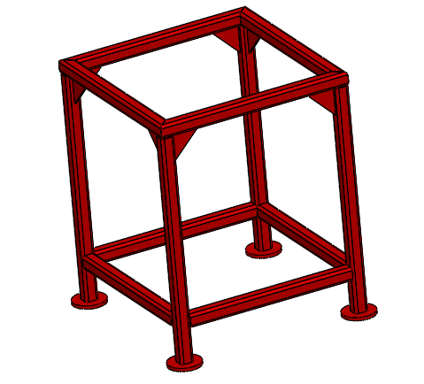
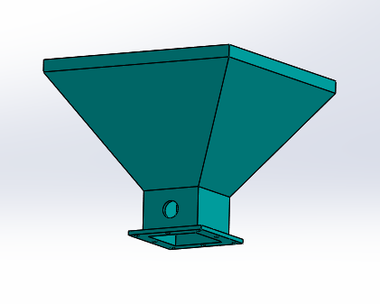
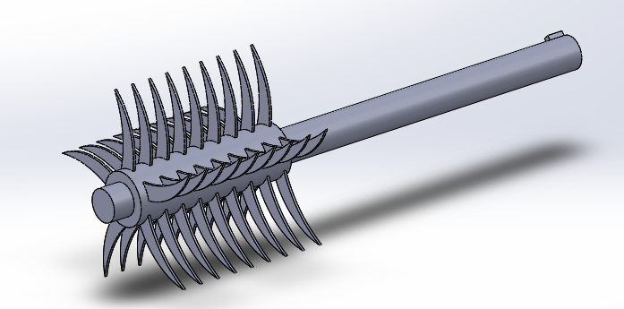

# Thermocol Recycling Machine

##  The primary Aim of a Thermocol Recycling Machine  is to convert Thermocol into a semi liquid or plastic form.

### Working of Thermocol Recycling Machine

## Assembly

## Parts 

### 1. Structure Frame

### 2. Hopper

### 3. Cutter

### 4. Screw Conveyor

### 5. conveyor Casing

### 6. Pipe casing

### 7. Bigger Pulley

### 8. Smaller Pulley

